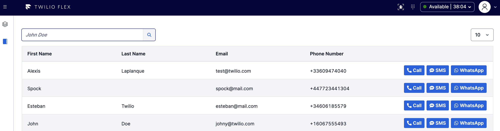

# Twilio Flex Hubspot Click-to-Call & Outbound SMS & WhatsApp Plugin

A Twilio Flex Plugin to leverage your customer data from Hubspot and initiate an outbound call or an outbound SMS on Flex. This plugin uses the [Hubspot APIs](https://developers.hubspot.com/docs/api/overview) to retrieve your customer data from Hubspot. Twilio Serverless is used for the the backend.



# Prerequisite

- Twilio Flex instance with Flex UI 2.0
- Twilio Phone Number
- Hubspot API Key is required to authenticate your API calls. [How to get your key?](https://knowledge.hubspot.com/integrations/how-do-i-get-my-hubspot-api-key)
- Twilio CLI tool with Flex Plugin and Serverless Plugin Extensions

Install the [Twilio CLI](https://www.twilio.com/docs/twilio-cli/quickstart) by running:
```bash
brew tap twilio/brew && brew install twilio
```

Then, install the [Flex Plugin extension](https://github.com/twilio-labs/plugin-flex/tree/v1-beta) for the Twilio CLI:
```bash
twilio plugins:install @twilio-labs/plugin-flex
```

Finally, install the [Serverless plugin extension](https://github.com/twilio-labs/plugin-serverless) for the Twilio CLI:
```bash
twilio plugins:install @twilio-labs/plugin-serverless
```

# Installation

## Serverless Function

First, you need to deploy the Twilio Serverless functions.

Move to the serverless folder and make a copy of the file **.env.sample** by running:
```bash
cd serverless
cp .env.sample .env
```

Update the .env file (located in the serverless folder) with your values :
```bash
ACCOUNT_SID=<Your Value>
AUTH_TOKEN=<Your Value>
HUBSPOT_API_KEY=<Your Value>
INBOUND_SMS_STUDIO_FLOW=<Your Value>
TASK_ROUTER_WORKSPACE_SID=<Your Value>
TASK_ROUTER_WORKFLOW_SID=<Your Value>
TASK_ROUTER_QUEUE_SID=<Your Value>
TWILIO_PHONE_NUMBER=<Your Value>
```

Update the file src/assets/templates.private.json with a JSON Array of string containing all your pre-approved WhatsApp Templates :
```json
[
  "My first template with {{customerFirstName}} and {{customerLastName}} and {{agentName}}.",
  "Hello {{customerFirstName}} {{customerLastName}}, it's {{agentName}} from WhatsApp, feel free to reach out to me if you need more help"
]
```

The available dynamic parameters are :
| Parameter      | Value |
| ----------- | ----------- |
| {{customerFirstName}}      | Customer Firstname from Hubspot       |
| {{customerLastName}}   | Customer Lastname from Hubspot        |
| {{agentName}}   | Flex Agent Name        |


Finally, deploy the serverless function by running:
```bash
npm run deploy
```

After the deployment, copy and keep the domain URL somewhere (example: `https://flex-hubspot-click-to-call-serverless-2348-xxx.twil.io`)

## Twilio Flex Plugin

Now you need to deploy the plugin, move to the root folder, and make a copy of the **.env.sample** file by running:
```bash
cp .env.sample .env
```

Update the **.env** with your values :
```bash
FLEX_APP_TWILIO_SERVERLESS_DOMAIN=<Your Value>
```

Next, deploy the flex plugin by running:
```bash
twilio flex:plugins:deploy --changelog "ADD A CHANGELOG"
```

Finally, release the flex plugin by running:
```bash
twilio flex:plugins:release --plugin flex-hubspot-click-to-call-plugin@1.0.0 --name "NAME OF THE RELEASE" --description "DESCRIPTION OF THE RELEASE"
```

# Development

First Move to the serverless folder and make a copy of the file **.env.sample** by running:
```bash
cd serverless
cp .env.sample .env
```

Update the .env (located in the serverless folder) with your values :
```bash
ACCOUNT_SID=<Your Value>
AUTH_TOKEN=<Your Value>
HUBSPOT_API_KEY=<Your Value>
INBOUND_SMS_STUDIO_FLOW=<Your Value>
TASK_ROUTER_WORKSPACE_SID=<Your Value>
TASK_ROUTER_WORKFLOW_SID=<Your Value>
TASK_ROUTER_QUEUE_SID=<Your Value>
TWILIO_PHONE_NUMBER=<Your Value>
```

Next, start the twilio serverless on your local machine by running:
```bash
npm start
```

Now you need to start the Flex plugin, move to the root folder, and make a copy of the **.env.sample** file by running:
```bash
cd ../
cp .env.sample .env
```

Next update the **.env** (located in the root folder) file with your local serverless instance hostname:
```
FLEX_APP_TWILIO_SERVERLESS_DOMAIN=<Your Value>
```

Finally start the local flex plugin instance from the root folder by running:
```bash
twilio flex:plugins:start
```